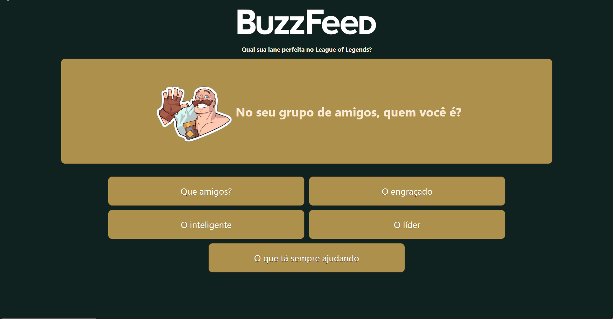

 <h1 align="center"> Angular BuzzFeed Clone </h1>

<div align="center">


</div>


<p align="justify">Este é um projeto que foi desenvolvido como parte do Coding The Future Banco PAN - Desenvolvimento Frontend com Angular. O objetivo deste projeto foi de criar um teste de personalidade estilo BuzzFeed, com perguntas e alternativas que mostrarão um resultado com base na alternativa de maior ocorrência. Fiz modificações no projeto proposto e escolhi a temática do jogo League of Legends para desenvolver a página. Para ver o deploy do projeto é só clicar <a href="https://viquiiz.github.io/angular-buzzfeed-clone/angular-buzzfeed-clone">aqui</a>.</p>
<br>
<p align="justify">This is a project developed as part of the "Coding The Future Banco PAN - Frontend Development with Angular" bootcamp. The goal was to create a BuzzFeed-style personality test, with questions and alternatives that will show a result based on the most selected alternative. I made modifications to the proposed project and chose the theme of the game League of Legends to develop the page. To see the project's deployment, just click <a href="https://viquiiz.github.io/angular-buzzfeed-clone/angular-buzzfeed-clone">here</a>.</p>


<br>

<div align="center">
    
    <p>Visualização do projeto no navegador</p>
</div>

<hr>

<h3>🛠 Instalando o projeto / how to install:</h3>
<br>

1- Clonar este repositório / clone the repository:
```
git clone https://github.com/viquiiz/angular-buzzfeed-clone.git
```

2- Instalar o Angular / install Angular: 
```
npm install -g @angular/cli
```

3- Instalar as dependências / install dependencies: 
```
npm install
```

<br>

<h3>💿 Rodando o projeto / running the project:</h3>

1- Iniciar o servidor local / start the local server: 
```
ng serve
```

2- Acessar no navegador / open in browser: 
```
http://localhost:4200
```
